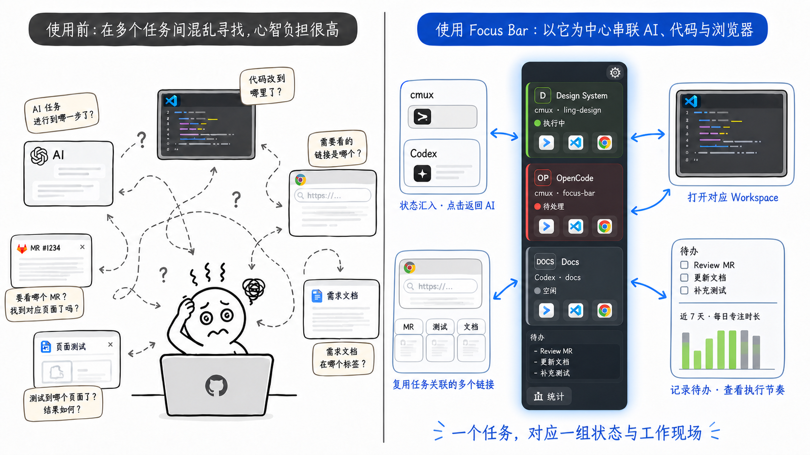

# Focus Bar

Focus Bar 是一个 macOS 本地 AI 任务注意力中枢。它连接 **cmux** 和 **Codex**，以任务为单位汇总 AI 状态，并把对应的 AI 会话、VS Code workspace、Chrome 页面、待办与执行统计收拢到屏幕左侧的一个入口。

状态变化会自动汇入 Focus Bar；需要继续工作时，点击任务或工具按钮即可回到对应的 cmux workspace、Codex 任务、代码窗口或浏览器标签页。



> 一个任务，对应一组状态与工作现场。Focus Bar 负责聚合信息与提供入口，不替代原有工具。

- [任务状态](#任务状态)
- [Chrome 与 VS Code 跳转](#chrome-与-vs-code-跳转)
- [任务执行统计](#任务执行统计)
- [前置条件](#前置条件)
- [安装与发布](#安装与发布)
- [开发](#开发)
- [验证](#验证)
- [数据源错误](#数据源错误)

## 任务状态

提示条用四种颜色表示每个任务的注意力状态：

| 状态 | 含义 |
| --- | --- |
| 🔴 需要处理 | cmux 有未读 Waiting、输入请求、阻塞或失败通知 |
| 🟡 待检查 | cmux 有未读 Completed、Done 或成功通知 |
| 🟢 执行中 | 最近一次提交晚于最近一次终态通知 |
| ⬜ 空闲 | 没有需要注意的活动 |

- **手动覆盖**：右键任务可临时覆盖状态；选择「自动判断」恢复自动状态。
- **可见范围**：界面只显示当前打开的 cmux workspace，`~/.focus.json` 中的历史记录不会被删除。

### Codex 任务

Codex 任务从 `~/.codex/state_*.sqlite` 和对应 session 事件中恢复：

- **执行中（绿）**：本轮已开始但尚未完成时保持绿色，即使后台 shell 长时间无新输出也不会变空闲。
- **待检查（黄）**：完成后、首次点击前显示黄色。
- **空闲（灰）**：点击跳回 Codex 后变灰。
- **保留规则**：普通空闲任务只显示最近 24 小时；运行中、等待输入、未查看完成、配置过跳转目标的任务不会因超时隐藏。
- **检查频率**：Codex 状态每 5 秒检查一次，运行时每 2 秒检查一次。

## Chrome 与 VS Code 跳转

点击提示条右上角的 `⚙️`，或右键任务选择「配置跳转目标」。配置窗口会列出当前 cmux workspace 和 Codex 任务，可为每个任务设置：

| 配置项 | 说明 |
| --- | --- |
| Chrome 链接 | 多个「标签 + 完整 URL」，如 Web MR、API MR；工具条直接显示这些标签按钮 |
| VS Code workspace 名称 | 用于匹配已打开窗口，可留空并从目录名推断 |
| VS Code workspace 目录 | 必填绝对路径 |
| 文件与行号 | 可选，文件路径相对于 workspace |

### Chrome 标签复用

点击 Chrome 链接时优先在选中的普通 Chrome 实例中复用已有 tab：

- 匹配忽略查询参数和 `#` 后缀。
- 同一 `/merges/<MR号>` 下的根页、Files、Commits 等视图视为同一目标。
- 找不到时才通过官方 Chrome 启动器在普通会话中打开新 tab。

多个 Chrome 实例同时运行时，Focus Bar 选择当前最前面的**普通** Chrome，忽略带 `--remote-debugging-port` 的调试实例。若只有调试实例，请先启动普通 Chrome。

### 反馈与权限

- 配置窗口可单独测试每个 Chrome 链接和 VS Code。
- 保存后提示条立即出现带标签的 `🌐` 按钮和 `📝` 图标，无需等待轮询。
- 工具条通过 hover、按压、加载中提示和成功/失败消息反馈跳转状态，并持续高亮每个任务最后一次成功打开的 Chrome 链接。

首次使用时 macOS 可能请求权限：

- **Chrome**：系统设置 → 隐私与安全性 → 自动化 → 授予 Google Chrome 控制权限。
- **VS Code**（精确聚焦已打开窗口）：系统设置 → 隐私与安全性 → 辅助功能。

> Focus Bar 只把 URL 和路径作为独立进程参数传递，不会拼接到 AppleScript 源码或 shell 命令中。

## 任务执行统计

点击工具条底部的「◷ 统计」查看今天或近 7 天的任务执行情况。统计直接复用 Focus Bar 已算好的任务红/绿状态，每次刷新记录一次状态区间，而不是猜测键盘或前台窗口。

展示内容：

- **总运行时长**：各任务执行时间累加，反映 AI 一直在干活的时间；头部同时显示统计范围起始时间。
- **每个任务**：执行、中断时长和轮次（几次执行、几次中断）。
- **分段条形图**：按时间顺序绘制，绿色为执行段、灰色为中断段，按时长比例缩放，直观呈现「执行 → 中断 → 执行」的间歇节奏。

统计口径：

- `executing` 计为执行时间。
- 任务变红（`needs_action` / `needs_review`）开始一段待闭合的中断；`idle` 既不执行也不清除该中断。
- 只有当同一任务之后再次进入 `executing` 时，这段中断才被记录并闭合；未闭合的红色尾段直接丢弃。
- 状态采集中断超过 15 秒会打断连续性，不跨离线时段补时间，避免应用关闭后虚增。

隐私与存储：本地采集只保存状态区间、来源和任务标识，**不**保存按键内容、AI 对话内容、网页内容或代码内容。数据保存在 `com.shamingming.focus-bar/activity.sqlite3`（系统应用数据目录）。旧的前台应用停留统计（`activity_segments` 表）保留但不再作为主统计。

## 前置条件

1. macOS 14 或更高版本。
2. 已安装 `/Applications/cmux.app`。
3. cmux 允许同一用户下的外部本地进程访问 socket。

在 cmux 配置 `~/.config/cmux/cmux.json` 中设置：

```json
{
  "$schema": "https://raw.githubusercontent.com/manaflow-ai/cmux/main/web/data/cmux.schema.json",
  "schemaVersion": 1,
  "automation": {
    "socketControlMode": "allowAll"
  }
}
```

修改前先备份配置，修改后按当前 cmux 版本要求 reload 或重启。Focus Bar 只检查该条件，不会自动修改 cmux 设置。

**一键开启**：如果因该配置未开启而报 `ACCESS_DENIED`，工具条顶部会出现「一键开启 cmux 访问」按钮。点击后 Focus Bar 会先把现有配置备份到 `cmux.json.focus-bar.bak`，再合并写入 `automation.socketControlMode = "allowAll"`（保留其它字段），然后提示你重启 cmux。除此之外不会主动改动 cmux 配置。

## 安装与发布

release 版本以 macOS `.dmg` 分发，可直接安装使用：

```bash
bun install
bun run tauri build
```

产物位于 `src-tauri/target/release/bundle/dmg/focus-bar_<版本>_aarch64.dmg`（Apple Silicon）。

用 GitHub Release 发布：

```bash
git tag v0.1.0 && git push origin v0.1.0
bun run tauri build
gh release create v0.1.0 \
  src-tauri/target/release/bundle/dmg/focus-bar_0.1.0_aarch64.dmg \
  --title "Focus Bar v0.1.0" --notes "首个可用版本"
```

**Gatekeeper 提示**：当前构建使用 ad-hoc 签名（`signingIdentity: "-"`），未经过 Apple 公证。从网络下载的用户首次打开会被拦截，可右键「打开」，或执行：

```bash
xattr -cr /Applications/focus-bar.app
```

安装后首次运行时，如果 cmux 尚未开启 socket 访问，点击工具条顶部的「一键开启 cmux 访问」并重启 cmux 即可。

## 开发

```bash
bun install
bun run tauri dev
```

**CLI 查找顺序**：

1. `CMUX_BUNDLED_CLI_PATH`
2. 当前 `PATH` 中的 `cmux`
3. `/Applications/cmux.app/Contents/Resources/bin/cmux`
4. `~/Applications/cmux.app/Contents/Resources/bin/cmux`

**socket 查找顺序**：`CMUX_SOCKET_PATH` → `~/.local/state/cmux/last-socket-path` → 交给 cmux CLI 自动发现。

## 验证

```bash
bun run check
cargo test --manifest-path src-tauri/Cargo.toml
cargo check --manifest-path src-tauri/Cargo.toml
python3 scripts/test_cmux_live.py
```

live doctor 默认只读。只有显式传入下面的参数时才会切换 workspace：

```bash
python3 scripts/test_cmux_live.py --jump workspace:1
```

## 数据源错误

| 错误码 | 含义 |
| --- | --- |
| `CLI_NOT_FOUND` | 找不到 cmux CLI |
| `CMUX_NOT_RUNNING` | cmux 未运行或 socket 不存在 |
| `ACCESS_DENIED` | 通常表示 `socketControlMode` 仍是 `cmuxOnly` |
| `TIMEOUT` | cmux 在限定时间内没有响应 |
| `INVALID_RESPONSE` | cmux 返回的数据无法解析 |
| `WATCHER_DISCONNECTED` | 实时事件流断开；界面保留最后一次成功数据，并继续重连和轮询 |
